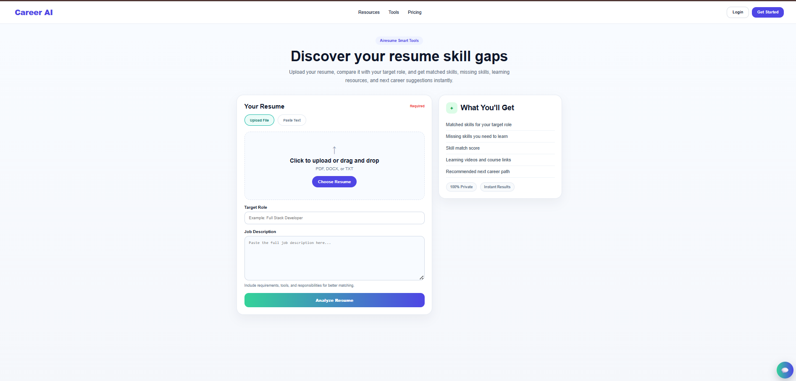
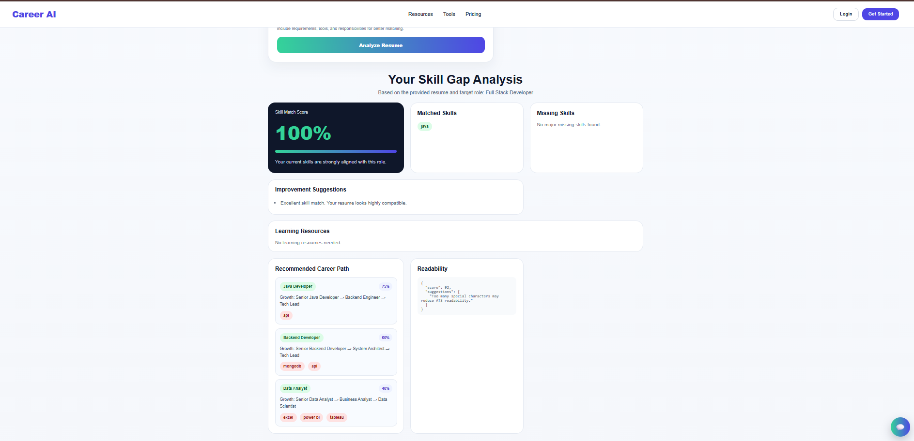
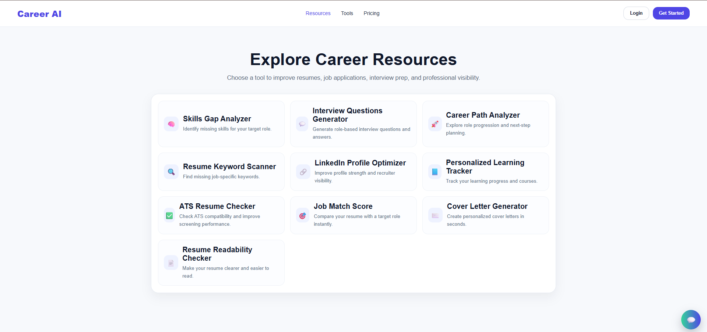
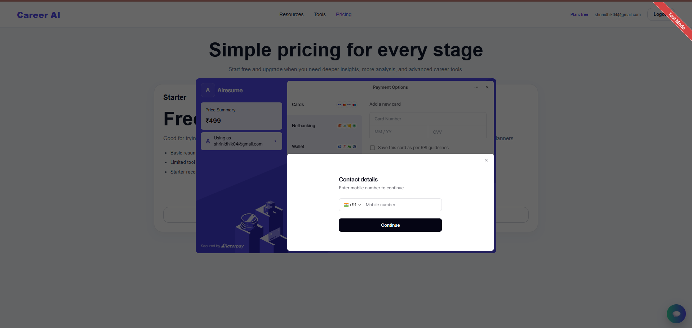

# CareerAI — AI-Powered Resume Analyzer & Career Intelligence Platform

CareerAI is a full-stack web application that analyzes resumes, evaluates ATS compatibility, identifies missing skills, and provides personalized career guidance with real-time insights.

---

## 🚀 Live Demo

* 🌐 Frontend: https://career-ai-chi-six.vercel.app
* ⚙️ Backend: https://careeraibackend.onrender.com

---

## ✨ Key Highlights

* 📄 Upload resume and analyze instantly
* 📊 Skill match score with detailed insights
* ❌ Missing skills identification
* 🧠 Career path recommendations
* 📝 ATS readability analysis
* 🎯 Interview question generation
* 🔍 Resume keyword scanning
* 💼 LinkedIn profile optimization
* 💳 Razorpay payment integration
* 📚 Learning resource suggestions

---

## 📸 Screenshots

### 🏠 Home Page — Resume Upload



### 📊 Resume Analysis — Skill Match & Suggestions



### 🧩 Career Tools & Features



### 💳 Payment Integration (Razorpay)



---

## 🧠 How It Works

1. Upload your resume (PDF format)
2. Enter target role and job description
3. Backend extracts and processes resume content
4. System analyzes:

   * Skill match score
   * Missing skills
   * ATS readability
5. Generates:

   * Improvement suggestions
   * Career path recommendations
   * Learning resources
6. Additional tools provide interview questions and profile optimization

---

## 🏗️ Architecture Overview

User → React Frontend → FastAPI Backend → NLP Processing → Analysis Engine → Response to UI

---

## 🛠️ Tech Stack

### Frontend

* React.js
* JavaScript
* CSS
* Axios
* Firebase Authentication

### Backend

* FastAPI
* Python
* spaCy (NLP)
* scikit-learn
* pdfplumber

### Integrations

* Razorpay (Payments)
* Firebase (Authentication)
* Vercel (Frontend Deployment)
* Render (Backend Deployment)

---

## 📂 Project Structure

CareerAI/
├── frontend/   # React UI
├── backend/    # FastAPI APIs
├── CHATBOT/    # Chatbot features
├── assets/     # Screenshots
└── README.md

---

## 🔌 Core Features

* Resume Parsing
* ATS Score Evaluation
* Skill Gap Detection
* Job Match Analysis
* Career Path Recommendation
* Interview Question Generator
* Cover Letter Generator
* Resume Keyword Scanner
* LinkedIn Profile Optimizer
* Learning Resource Finder

---

## ⚙️ Run Locally

### Clone Repository

```bash
git clone https://github.com/shrinidhinaik23/CareerAI.git
cd CareerAI
```

### Backend Setup

```bash
cd backend
pip install -r requirements.txt
uvicorn main:app --reload
```

### Frontend Setup

```bash
cd frontend
npm install
npm start
```

---

## 🔐 Environment Variables

Create `.env` file in backend:

```env
RAZORPAY_KEY_ID=your_key
RAZORPAY_KEY_SECRET=your_secret
YOUTUBE_API_KEY=your_key
FIREBASE_CREDENTIALS_PATH=your_path
```

---

## ⚡ Performance

* Fast API responses for individual features
* Complete resume analysis generated within a few seconds
* Optimized for real-time interaction

---

## ⚠️ Limitations

* Accuracy depends on resume format
* NLP-based matching may miss rare skills
* Backend cold start delay (free hosting)
* Limited dataset for skill comparison

---

## 🚧 Challenges Faced

* Extracting structured data from PDF resumes
* Matching resumes with job descriptions accurately
* Handling inconsistent skill keywords
* Integrating secure payment gateway
* Managing frontend-backend communication

---

## ✅ Solutions Implemented

* Applied NLP preprocessing techniques
* Designed modular API-based backend
* Implemented skill matching and gap analysis
* Integrated Razorpay for secure payments
* Deployed scalable frontend/backend setup

---

## 🚀 Future Improvements

* Advanced AI-based recommendations
* Improved ATS scoring algorithm
* Resume auto-enhancement suggestions
* Multi-language support
* Mobile application version

---

## 📌 Key Learnings

* Full-stack development (React + FastAPI)
* NLP-based resume analysis
* API design and integration
* Payment gateway integration
* Real-world deployment practices

---

## 👨‍💻 Author

**Shrinidhi Manjunath Naik**

* GitHub: https://github.com/shrinidhinaik23

---
